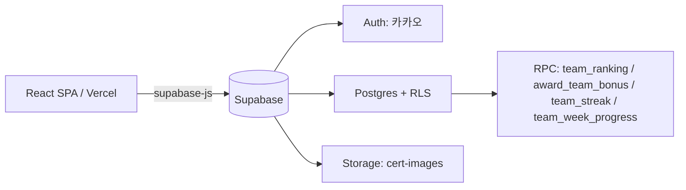

# Analyze — 돈독(Don-Dok) Supabase 기반 팀 다이어트 챌린지 웹앱 MVP 구현

> 타입: feature | 생성: 2026-06-29 | 분석 깊이: deep
> 소스: `C:\GITHUB\Dondok\돈독_기획설계문서.md` (v2.0)

## 📊 분석 요약

| 항목 | 내용 |
|------|------|
| 프로젝트 성격 | **그린필드** (코드 없음, 설계 문서 v2.0만 존재) |
| 신규 생성 영역 | Supabase(DB 7테이블 + RLS + RPC 4 + Edge Function 1) + React SPA(7페이지) |
| 핵심 산출물 | 마이그레이션 SQL · RLS 정책 · RPC 함수 · React 프론트 |
| 예상 소요 시간 | ~14~20시간 (1인, MVP 전체) |
| 미결 결정사항 | 2개 (D-05 UI 라이브러리, D-06 서버상태 캐싱) |
| 위험도 | LOW (규모 20~25명, BaaS로 인프라 리스크 최소) |

---

## 📍 현재 상태 (As-Is)

### 구조
- 코드베이스 없음. 산출물은 설계 문서 1개(`돈독_기획설계문서.md` v2.0)뿐.
- 문서에는 다음이 이미 확정되어 있음:
  - 스택: React(Vite) + Supabase(Postgres·Auth·Storage·Auto API)
  - DB 스키마(DDL), RLS 정책, RPC 함수 4개, 클라이언트 호출 예시, 화면 구조
  - 도메인 로직: 시즌 단위 운영, 감량률(%) 랭킹, 최종 점수 공식, 데일리 보너스, 인증 피드+리액션, 스트릭/공동목표

### 동작
- 현재 동작하는 시스템 없음. 모든 기능은 신규 구현 대상.

### 문제점 / 제약
- **P-01**: 실행 가능한 코드/스키마가 없어 운영 불가 (설계만 존재).
- **P-02**: Supabase 프로젝트·카카오 OAuth 앱·Storage 버킷 등 외부 사전 설정이 미완.
- **P-03**: 설계 문서의 SQL은 검증 전 상태 — 실제 Supabase(PG15)에 적용해 동작 확인 필요.

### 측정 가능한 지표 (현재)
| 지표 | 현재 값 | 측정 방법 |
|------|---------|---------|
| 구현된 테이블 수 | 0 / 7 | Supabase 스키마 |
| 동작하는 RPC 수 | 0 / 4 | `team_ranking` 등 |
| 구현된 화면 수 | 0 / 7 | React pages |

---

## 🎯 구현 후 상태 (To-Be)

### 구조 변화

### 동작 변화
- 사용자가 카카오로 로그인 → 프로필/팀 설정 → 매일 인증(식단·운동) → 피드·달력에서 공유·응원 → 대시보드에서 랭킹·스트릭·공동목표 확인.
- 권한은 RLS가 강제, 집계는 RPC로 단발 호출.

### 해결되는 문제
- **P-01 → 해결**: 마이그레이션 SQL + React 앱으로 실제 운영 가능.
- **P-02 → 해결**: tasks.md PRE 단계에서 Supabase/카카오/버킷 사전 설정.
- **P-03 → 해결**: 마이그레이션 적용 후 RPC 스모크 검증(V01~)으로 동작 확인.

### 측정 가능한 지표 (목표)
| 지표 | 현재 | 목표 | 비고 |
|------|------|------|------|
| 테이블 | 0 | 7 | season/profile/team/inbody_history/certification/cert_reaction/team_bonus |
| RPC | 0 | 4 | ranking/award_bonus/streak/week_progress |
| 화면 | 0 | 7 | Login/ProfileSetup/TeamSetup/Dashboard/Inbody/Calendar/Feed |
| MVP 시즌 운영 | 불가 | 가능 | 25명 1시즌 완주 |

---

## 💡 AI 제안사항 (Proactive Suggestions)

### S-01: 클라이언트 측 이미지 압축 [제안 중]
**영역**: 성능 / 운영
**왜 제안하는가**: Supabase 무료 Storage는 1GB. 25명이 매일 식단(여러 끼)+운동 사진을 원본으로 올리면 한 시즌(8주) 내 한도 압박 가능. 설계 문서도 "사진 자동 리사이즈"를 Phase 2로 두고 있으나, **업로드 전 브라우저 압축**은 라이브러리 1개로 즉시 적용 가능.
**무엇을 해야 하는가**: 업로드 전 `browser-image-compression`으로 ~1280px/0.7품질 리사이즈 후 Storage 업로드.
**예상 효과**: 스토리지 사용량 5~10배 감소, 피드 로딩 속도 개선.
**예상 소요**: ~30분 | **복잡도**: LOW | **스코프**: 본 스펙 포함 권장

### S-02: 시드 마이그레이션(시즌 1 + ADMIN) [제안 중]
**영역**: 운영
**왜 제안하는가**: 시즌·팀이 없으면 어떤 화면도 동작하지 않음(랭킹/보너스가 season_id 의존). 최초 운영을 위해 시즌 1행 + 운영자 ADMIN 지정이 필요.
**무엇을 해야 하는가**: `seed.sql`로 활성 시즌 1개 생성, 특정 user를 `role=ADMIN`으로 승격하는 절차 문서화.
**예상 효과**: 배포 직후 바로 운영 시작 가능.
**예상 소요**: ~20분 | **복잡도**: LOW | **스코프**: 본 스펙 포함

### S-03: RPC 스모크 테스트 스크립트 [제안 중]
**영역**: 테스트
**왜 제안하는가**: 4개 RPC(특히 `team_ranking`의 CTE·`team_streak`의 gaps-and-islands)는 로직이 까다로워 수동 검증이 필요. 더미 데이터로 기대값을 한 번에 확인하면 회귀 방지.
**무엇을 해야 하는가**: 더미 시즌/팀/인바디/인증을 넣고 RPC 결과를 검증하는 SQL 스크립트(`smoke.sql`).
**예상 효과**: 랭킹/스트릭 계산 오류 조기 발견.
**예상 소요**: ~40분 | **복잡도**: MEDIUM | **스코프**: 본 스펙 포함 권장

---

## 🔍 관련 파일 목록 (신규 생성)

| 파일 경로(예정) | 역할 | 영향도 | 비고 |
|-----------|------|--------|------|
| `supabase/migrations/0001_schema.sql` | 7테이블 + 인덱스 + 순환FK ALTER | HIGH | 설계 §5.2 |
| `supabase/migrations/0002_rls.sql` | RLS 정책 + Storage 정책 | HIGH | 설계 §5.3, §7.2 |
| `supabase/migrations/0003_rpc.sql` | RPC 4 + auth 트리거 | HIGH | 설계 §6 |
| `src/lib/supabase.js` | supabase-js 클라이언트 | HIGH | 설계 §8.2 |
| `src/pages/*.jsx` | 7개 페이지 | HIGH | 설계 §8.2 |
| `src/components/*.jsx` | RankingTable/CertCard/ReactionBar/CertCalendar 등 | MEDIUM | 설계 §8.2 |
| `seed.sql` / `smoke.sql` | 시드 · 스모크 | LOW | S-02, S-03 |

---

## ⚡ 영향도 평가

### HIGH — 핵심 구현 대상
- DB 마이그레이션(스키마·RLS·RPC) — 모든 기능의 토대.
- React 페이지(Dashboard/Inbody/Calendar/Feed) — 사용자 가치 직접 전달.

### MEDIUM — 보조 컴포넌트
- 공용 컴포넌트(ReactionBar/CertCalendar/CertUploadModal/InbodyChart).
- 인증 라우팅 가드, 프로필/팀 설정 플로우.

### LOW — 설정/운영
- 환경변수(.env), Vercel 배포 설정, 시드/스모크 스크립트.

---

## ❓ 결정사항 (Decision Items)

### D-01: 식단 인증 다중 허용(식사시간별) [결정됨]
설계 v2.0에서 결정: 식단은 식사시간(아침/점심/저녁/간식)별 1회, 운동은 하루 1회. PG15 `NULLS NOT DISTINCT` 유니크 제약 사용.

### D-02: 보너스 판정 시점 [결정됨]
MVP는 **인증 등록 직후 해당 팀만 재판정**(`award_team_bonus` 호출). pg_cron 일괄은 Phase 2.

### D-03: 랭킹 산출 방식 [결정됨]
실시간 RPC(`team_ranking`). 주간 스냅샷 캐싱은 제외(Phase 2 히스토리용).

### D-04: 인증/호스팅 [결정됨]
카카오 OAuth(Supabase Auth) + Vercel(프론트) + Supabase 무료티어.

### D-05: UI 라이브러리 [결정됨]
**채택: Tailwind CSS** (v4 + `@tailwindcss/vite`). 모바일 우선 피드/달력 커스텀 자유도. 빌드 검증 완료.

### D-06: 서버 상태 캐싱(TanStack Query) [미결정]
| 선택지 | 설명 | 장점 | 단점 |
|--------|------|------|------|
| A. 도입 | 랭킹/피드 캐싱·자동 갱신 | UX·재요청 최적 | 의존성·러닝 |
| B. 미도입 | supabase-js 직접 + useState | 단순 | 캐싱 수동 |
| **채택** | **B. 미도입** — MVP는 단순하게, 필요 시 추후 도입 | | |

### D-07: 인바디 입력 방식 [결정됨]
**채택: 사진 OCR 자동 기입(B안) + 수기 보정 폴백 — MVP 포함.**
인바디 결과지 사진을 Edge Function(`extract_inbody`)으로 비전 API(Claude vision 권장) 호출해 수치 추출 → 입력 폼 자동 채움 → 사용자 확인/보정 후 저장(`image_path` 동반). 추출 실패/저신뢰 시 수기 입력. ※ 이로써 Edge Function + 외부 비전 API 키가 본 프로젝트의 **유일한 서버 로직/외부 비용** 지점이 됨(트레이드오프 수용).

---

## ⏱️ 소요 시간 추정

| 단계 | 복잡도 | 추정 | 근거 |
|--------|--------|-----------|------|
| PRE (Supabase·카카오·버킷 설정) | LOW | ~1시간 | 콘솔 설정 |
| 마이그레이션(스키마/RLS/RPC) | MEDIUM | ~3시간 | SQL 작성+적용+스모크 |
| 인증·프로필·팀 플로우 | MEDIUM | ~3시간 | OAuth 연동 포함 |
| 인바디·랭킹 화면 | MEDIUM | ~3시간 | 차트·RPC 연동 |
| 인증·달력·피드·리액션 | HIGH | ~5시간 | 업로드·썸네일·리액션 |
| 스트릭·공동목표·대시보드 통합 | MEDIUM | ~2시간 | RPC 표시 |
| 배포(Vercel) | LOW | ~1시간 | 도메인 연결 |
| **합계** | | **~18시간** | |

---

## ⚠️ 리스크 및 제약

| 리스크 | 가능성 | 영향 | 대응 |
|--------|------------|--------|-----------|
| 카카오 OAuth 설정 오류(redirect URI) | MEDIUM | MEDIUM | PRE 단계에서 Supabase Auth Provider 설정·테스트 우선 |
| RLS 재귀/누락으로 데이터 노출·차단 | MEDIUM | HIGH | 스모크로 "타 팀 데이터 차단" 검증(V03) |
| Storage 1GB 한도 | LOW | MEDIUM | S-01 이미지 압축 |
| RPC 로직 오류(스트릭/랭킹) | MEDIUM | MEDIUM | S-03 스모크 |
| **인바디 OCR 오인식** | MEDIUM | MEDIUM | 저장 전 확인/보정 UI 필수, 저신뢰 시 수기 폴백, confidence 반환 |
| **비전 API 키 노출** | LOW | HIGH | Edge Function 시크릿로만 보관, 클라이언트 노출 금지 |
| 인바디 사진 민감정보 | LOW | MEDIUM | 비공개 버킷 + 서명 URL 또는 팀 스코프 read 강화 검토 |
| BaaS 락인 | LOW | LOW | 표준 Postgres → 덤프 이전 가능 |

---

## 🔗 유사 구현 참조

| 패턴 | 위치 | 활용 |
|--------|--------------|-----------|
| 감량률/랭킹 SQL | 설계 §6.1 | `team_ranking` RPC 그대로 이식 |
| gaps-and-islands 스트릭 | 설계 §6.4 | `team_streak` |
| RLS 팀 스코핑 | 설계 §5.3 | inbody/cert/reaction 정책 |
| supabase-js 호출 | 설계 §7.1 | 페이지별 데이터 호출 |

---

## ✅ 사전 검토 체크리스트
- [ ] Supabase 프로젝트 생성 + anon/url 키 확보
- [ ] 카카오 Developers 앱 등록 + Supabase Auth Provider 연결
- [ ] Storage 버킷 `cert-images` 생성
- [ ] D-05(UI 라이브러리) 결정
- [ ] D-06(서버상태 캐싱) 결정
- [ ] 예상 소요(~18시간) 사용자 확인
