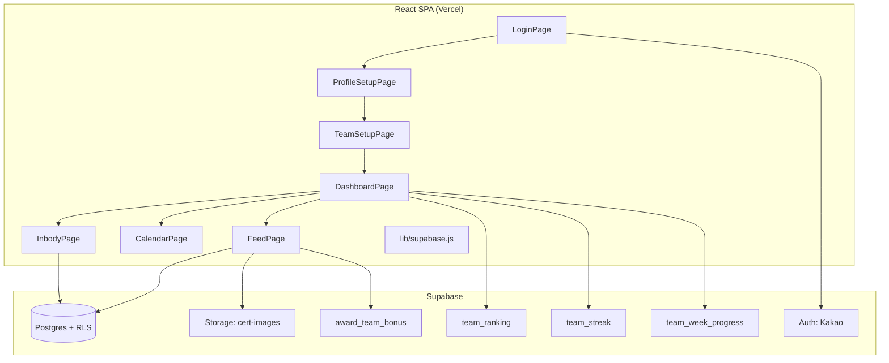
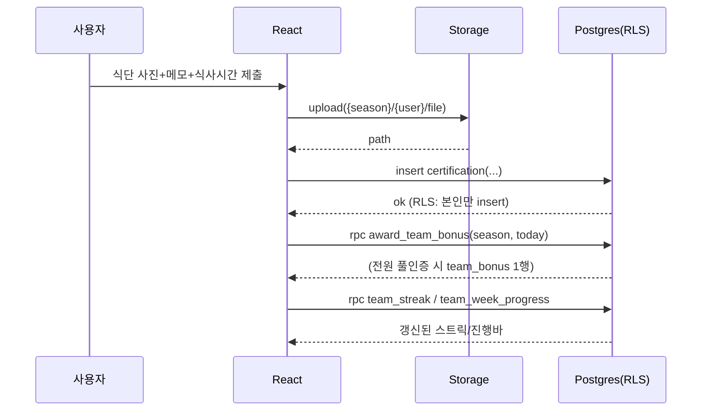

# Design — 돈독 MVP

> 타입: feature | 소스: 돈독_기획설계문서.md v2.0

## 코드베이스 분석 요약
그린필드. 설계 문서 v2.0이 스키마·RLS·RPC·화면을 이미 확정. 본 설계는 그것을 **구현 단위(마이그레이션 + React)**로 분해하고 빌드 순서를 정의한다.

---

## 컴포넌트 맵

---

## 데이터 모델 (7테이블)
설계 §5.2 그대로. 생성 순서 주의(순환 FK):
`season → profile(team_id FK 보류) → team → ALTER profile FK → inbody_history → certification → cert_reaction → team_bonus`

| 테이블 | 핵심 제약 |
|--------|----------|
| season | status(PLANNED/ONGOING/CLOSED) |
| profile | PK=auth.users.id, team_id FK(ALTER 추가) |
| team | invite_code UNIQUE, season_id FK |
| inbody_history | idx(user_id,season_id,measured_date), is_baseline, **image_path**(OCR 원본) |
| certification | `unique nulls not distinct (user_id,cert_date,cert_type,meal_time)` |
| cert_reaction | unique(cert_id,user_id,emoji), FK on delete cascade |
| team_bonus | unique(team_id,bonus_date) |

---

## 변경(생성) 대상 파일

| 경로 | 내용 | 이유 | 영향도 |
|------|------|------|--------|
| `supabase/migrations/0001_schema.sql` | 7테이블+인덱스+ALTER | 토대 | HIGH |
| `supabase/migrations/0002_rls.sql` | RLS 정책 + Storage 정책 | 권한 강제 | HIGH |
| `supabase/migrations/0003_rpc.sql` | RPC 4 + handle_new_user 트리거 | 집계/자동프로필 | HIGH |
| `supabase/functions/extract_inbody/index.ts` | 인바디 사진 → 비전 API → 수치 JSON | OCR 자동기입(REQ-10a/b) | HIGH |
| `seed.sql` | 활성 시즌 1 + ADMIN 승격 | 운영 시작 | MEDIUM |
| `smoke.sql` | 더미데이터 + RPC 검증 | 회귀 방지 | MEDIUM |
| `src/lib/supabase.js` | createClient | 단일 인스턴스 | HIGH |
| `src/auth/RequireAuth.jsx` | 라우팅 가드 | REQ-03 | MEDIUM |
| `src/pages/LoginPage.jsx` | 카카오 로그인 | REQ-01 | HIGH |
| `src/pages/ProfileSetupPage.jsx` | 닉네임·체격 | REQ-02 | MEDIUM |
| `src/pages/TeamSetupPage.jsx` | 생성/가입 | REQ-06,07 | HIGH |
| `src/pages/DashboardPage.jsx` | 랭킹+스트릭+진행바+오늘현황 | REQ-12,20,21 | HIGH |
| `src/pages/InbodyPage.jsx` | 사진→OCR 자동기입→확인/보정 입력 + 추이차트 | REQ-09,10,10a,10b | HIGH |
| `src/pages/CalendarPage.jsx` | 사진 다이어리 | REQ-16 | HIGH |
| `src/pages/FeedPage.jsx` | 피드+리액션 | REQ-17,18 | HIGH |
| `src/components/*` | RankingTable/TeamSummaryCard/CertCard/ReactionBar/CertCalendar/CertUploadModal/InbodyChart | 재사용 | MEDIUM |

---

## 결정사항 반영
- D-01 식단 다중(meal_time + NULLS NOT DISTINCT) → `0001_schema.sql`.
- D-02 보너스 즉시 재판정 → 인증 등록 성공 후 `award_team_bonus` 호출(Feed/Upload 플로우).
- D-03 실시간 랭킹 RPC → 스냅샷 테이블 미생성.
- D-04 카카오+Vercel+Supabase.
- D-05 UI 라이브러리 / D-06 캐싱 → **PRE에서 사용자 확정 필요**(미결).

---

## 시퀀스 — 인증 등록 → 보너스 판정

---

## 오류 처리 전략
- 정원 초과 가입 → REQ-07: RPC/제약 위반을 사용자 메시지("정원이 찼습니다")로 변환.
- 중복 인증 → unique 위반(23505)을 "이미 인증함"으로 변환.
- 업로드 실패 → certification insert 보류(고아 레코드 방지: 업로드 성공 후 insert 순서 유지).
- RLS 차단으로 빈 결과 → 정상 처리(빈 상태 UI).

---

## 테스트 전략
- **DB 스모크(smoke.sql)**: 더미 시즌/팀/인바디/인증으로 `team_ranking` 정렬·`team_streak` 연속일·`award_team_bonus` 전원조건·`team_week_progress` done/goal 검증.
- **RLS 검증**: 서로 다른 팀 2계정으로 교차 조회 시 0건 확인(V03).
- **수동 E2E**: 로그인→팀→인바디2회→인증→피드/리액션→대시보드 1사이클.

---

## 빌드 순서(권장)
1. 마이그레이션(스키마→RLS→RPC) + seed + smoke
2. supabase.js + 카카오 로그인 + 라우팅 가드
3. 프로필/팀 설정
4. 인바디 + 랭킹 대시보드
5. 인증 업로드 + 달력 + 피드/리액션
6. 스트릭/공동목표 대시보드 통합
7. Vercel 배포
