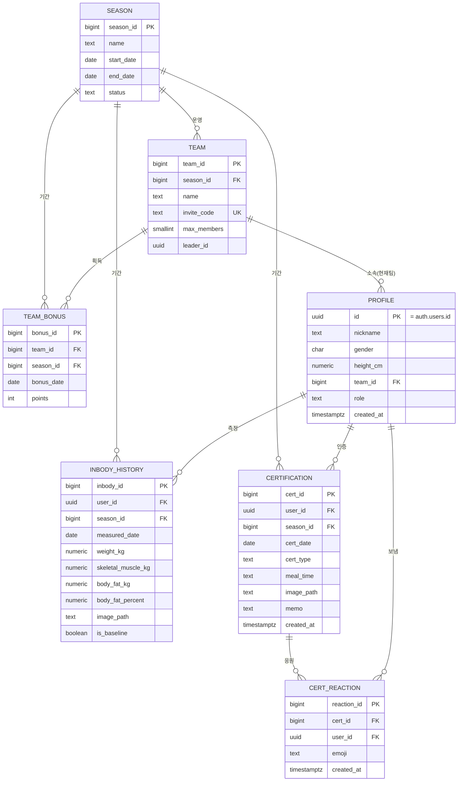

# 돈독 (Don-Dok) — 기획 · 설계 문서

> "돈독하게 모여 독하게 빼자" — 팀 단위 다이어트 챌린지 웹 서비스

| 항목 | 내용 |
|---|---|
| 문서 버전 | **v2.0 (Supabase 기반 / 초경량 재설계)** |
| 대상 | 크로스핏 센터 내부 다이어트 챌린지 (**20~25명, 개인 운영**) |
| 작성 관점 | "최소 비용·최소 서버"로 빨리 만들어 직접 쓰는 사이드 프로젝트 |
| 기술 스택 | **React (Vite SPA)** + **Supabase**(Postgres · Auth · Storage · Auto API) |
| 핵심 원칙 | 백엔드 서버를 **직접 만들지 않는다.** DB·권한·SQL 설계가 곧 백엔드다. |

---

## 0. v1.1 → v2.0 무엇이 바뀌었나 (요약)

| | v1.1 (스프링) | **v2.0 (Supabase)** | 이유 |
|---|---|---|---|
| 백엔드 | Spring Boot 3.x 직접 구현 | **Supabase (BaaS)** | 20~25명 규모에 스프링은 오버스펙. Controller/Service/Repository/JWT/CORS/파일핸들러를 안 만들어도 됨 |
| 인증 | JWT 직접 구현 | **Supabase Auth + 카카오 로그인** | 비번 저장·해싱·재설정·토큰관리 전부 제거. 가입 마찰 최소 |
| API | REST 컨트롤러 수동 작성 | **PostgREST 자동 API + RPC 함수 몇 개** | 테이블 만들면 CRUD API가 자동 생성됨 |
| DB | MariaDB | **Postgres 15 (Supabase 내장)** | CTE·윈도우함수·`distinct on` 다 지원. 랭킹 SQL 그대로 이식 |
| 이미지 | 로컬/S3 직접 처리 | **Supabase Storage** | 버킷 + 권한정책으로 끝 |
| 권한 | 서버 코드에서 검증 | **RLS(Row Level Security) 정책** | 권한을 DB가 강제 → 백엔드 코드 불필요 |
| 캐싱 | 주간 스냅샷 테이블 | **제거(실시간 쿼리)** | 25명이면 실시간 쿼리가 즉답. 추이기록은 Phase 2 |
| 호스팅 | VM 직접 운영 | **Vercel(무료) + Supabase(무료)** | 콜드스타트·운영부담 없음 |

> **남긴 자산:** 감량률(%) 기반 공정 랭킹, 시즌 개념, 팀 최종 점수 공식, 데일리 팀 보너스, 인증 피드 — 도메인 로직은 v1.1 그대로 유지.

---

## 1. 프로젝트 개요

| | |
|---|---|
| **서비스명** | 돈독 (Don-Dok) |
| **한 줄 요약** | 혼자 하면 실패하는 다이어트를, 팀 경쟁과 데일리 인증으로 완주하게 돕는 웹 서비스 |
| **핵심 가치** | ① 팀원 간 유대 ② 타 팀과의 경쟁 ③ 공정한 랭킹 |
| **운영 단위** | 한 시즌(예: 8주) 단위 |
| **목표** | 일단 웹으로 직접 운영 → 반응 좋으면 동일 백엔드(Supabase)로 앱(React Native) 확장 |

**왜 팀제인가:** 크로스핏 센터는 "박스(box)" 단위 공동체 문화가 강합니다. 개인 랭킹만 두면 상위권 외엔 금방 이탈하지만, 3~5명 팀으로 묶으면 "내가 안 하면 우리 팀이 진다"는 사회적 압력이 지속성을 만듭니다. 이 압력을 **인증 피드**(§4④)가 매일 자극합니다.

---

## 2. 기술 스택 & 선택 사유

| 레이어 | 채택 | 사유 |
|---|---|---|
| Frontend | **React 18 + Vite** | 가볍고 빠름. 모바일 비중 높은 챌린지에 SPA 적합 |
| 백엔드(BaaS) | **Supabase** | Postgres + Auth + Storage + 자동 REST/Realtime API를 무료 티어로 제공. 별도 서버 0 |
| DB | **Postgres 15** (Supabase 내장) | CTE·윈도우함수·`distinct on` 지원. 랭킹 로직 표현력 충분 |
| 인증 | **Supabase Auth (카카오 OAuth)** | 지인 20명 대상 → 소셜 로그인이 가장 마찰 적음 |
| 이미지 | **Supabase Storage** | 인증/식단 사진 업로드. 버킷 + RLS 정책 |
| 권한 | **RLS (Row Level Security)** | "남의 팀 데이터 못 봄"을 DB가 강제 |
| 추가 로직 | **Edge Function** | **인바디 사진 OCR**(비전 API로 수치 추출, §6.5)에 사용. 그 외 일괄 작업은 선택적. ※ 이 프로젝트에서 유일하게 외부 API 키·서버 로직이 붙는 지점 |
| 배포 | **Vercel / Cloudflare Pages** (무료) | React 정적 빌드 서빙. 도메인 연결 |

> **Supabase 무료 티어 한도(2026 기준 대략):** DB 0.5GB · Storage 1GB · 월 50,000 MAU. 25명 규모는 **여유롭게 무료** 범위.

---

## 3. 시스템 아키텍처

```
┌─────────────────┐   supabase-js (HTTPS)   ┌────────────────────────────┐
│   React SPA     │ ──────────────────────▶ │         Supabase           │
│   (Vite, Vercel)│ ◀────────────────────── │ ┌────────────────────────┐ │
└─────────────────┘   JWT(자동) / Realtime   │ │ Auth (카카오 OAuth)     │ │
        │                                    │ ├────────────────────────┤ │
        │                                    │ │ Postgres + RLS         │ │
        └── supabase.auth / .from / .rpc     │ │  + PostgREST 자동 API   │ │
            .storage                         │ │  + RPC(랭킹 함수)        │ │
                                             │ ├────────────────────────┤ │
                                             │ │ Storage (cert-images)  │ │
                                             │ └────────────────────────┘ │
                                             └────────────────────────────┘
```

- **서버를 우리가 운영하지 않는다.** React는 Supabase에 직접 말을 건다(`supabase-js`).
- **권한은 RLS가 강제한다.** 클라이언트가 직접 DB를 호출해도, 정책에 걸린 행만 보인다 → "프론트가 DB를 직접 부르는데 안전한" 구조.
- **복잡한 집계(랭킹)는 RPC(Postgres 함수)로** 캡슐화해 한 번에 호출한다.

---

## 4. 핵심 도메인 & 비즈니스 로직 (MVP)

> **날짜 경계:** 모든 "오늘/일자" 판정은 **KST(Asia/Seoul)** 기준. `timestamptz`로 저장하고 일자는 `(created_at at time zone 'Asia/Seoul')::date`로 계산.

### ⓪ 시즌(Season) — 모든 집계의 기준 단위
- 챌린지는 **시즌(예: 8주) 단위**. baseline·감량률·랭킹·보너스는 **모두 특정 시즌에 귀속**.
- **왜 처음부터 넣나:** 시즌이 없으면 baseline이 "회원 최초 1회"로 고정돼 **시즌 2부터 랭킹이 어긋남**. 테이블 하나라 비용도 작아 처음부터 둠.
- baseline = "**해당 시즌 내 회원의 최초 측정값**".

### ① 회원가입 & 팀 빌딩
- **카카오 로그인** → 최초 로그인 시 `profile` 자동 생성(닉네임/체격만 1회 입력).
- [팀 생성] 또는 [초대 코드로 가입]. 팀 인원 **3~5명**, 가입 시 정원 검증.
- 팀 생성자 = 리더(`role=LEADER`).

### ② 인바디 히스토리 & 공정 랭킹
- 시즌 내 최초 1회(baseline), 이후 매주 인바디 입력(체중·골격근량·체지방량).
- **인바디 사진 자동 기입(OCR, MVP):** 인바디 결과지 사진을 올리면 **Edge Function**이 비전 API(Claude vision 권장)로 체중·골격근량·체지방량·체지방률을 추출해 **입력 폼을 자동으로 채움**. 사용자는 사진·추출값(+지난주 내 수치 비교)을 보며 **확인·보정** 후 저장. 사진은 `image_path`로 함께 보관(신뢰성↑). **추출 실패/오인식 시 수기 입력으로 폴백** — OCR은 같은 폼을 미리 채우는 보조일 뿐, 수기 입력은 항상 가능.
- **감량률(%)** 로 비교(절대 kg 아님):
  - 체중 감량률 = `(초기체중 − 현재체중) / 초기체중 × 100`
  - 체지방 감량률 = `(초기체지방 − 현재체지방) / 초기체지방 × 100`
- 팀 감량률 = 팀원 감량률의 **평균**.
- **미측정 회원:** baseline만 있고 이후 미측정 → `latest = baseline` → 0%로 평균에 포함(패널티). baseline 자체가 없으면 산정 제외.

### ②-1 팀 최종 점수 공식
> 인증 보너스가 순위에 반영돼야 인증할 동기가 생긴다. 감량률 + 보너스를 한 점수로 합산.

- `최종점수 = 체지방감량률 × W_FAT + 체중감량률 × W_WEIGHT + 누적보너스 × W_BONUS`
- 기본 가중치: **`W_FAT=1.0`, `W_WEIGHT=0.5`, `W_BONUS=0.1`** (체지방 비중 최대 = 근손실 방지·건강한 감량).
- 정렬: 최종점수 ↓ → 동률 시 체지방감량률 → 누적보너스.

### ③ 데일리 인증 & 체크리스트
- 매일 [식단 인증], [운동 인증] = 사진 + 메모.
- **식사시간 태그:** 식단 인증은 `meal_time`(아침/점심/저녁/간식) 태그를 붙임 → 피드·달력이 풍부해지고, "하루 1유형 1회" 제약이 식사시간별로 완화됨(아침·점심·저녁 각각 인증 가능).
- **달력 = 사진 다이어리:** 달력 셀에 그날 인증 **사진 썸네일**을 표시. **본인↔팀원** 달력 토글로 서로의 식단/운동을 한눈에. (별도 데이터 추가 없이 기존 인증 사진을 달력 뷰로 보여줌)
- **팀 보너스:** 당일 팀원 전원이 식단+운동 모두 인증 시 팀에 보너스 포인트.

### ④ 인증 피드 + 응원 리액션 (인스타 스타일 — MVP 포함)
- 인증 데이터(`certification`)를 **시간순 사진 카드 피드**로 보여주는 화면. 범위는 **우리 팀 피드**(사진 + 닉네임 + 식사태그 + 메모 + 시각).
- **응원 리액션(MVP 핵심):** 팀원 인증에 이모지(🔥👍💪👏) 한 번 탭. "서로 반응하는" 레버 → 의욕의 핵심. 한 사람이 한 인증에 같은 이모지 1회(`cert_reaction`).
- **댓글·팔로우는 Phase 2** (댓글은 분위기 관리 부담이 커 MVP엔 제외). 리액션만으로 "남들 올리고 응원하니 나도 한다"는 선순환을 만듦.

### ⑤ 함께하기 — 팀 스트릭 & 주간 공동 목표
> "내 감량"뿐 아니라 "우리 팀이 함께 채운다"는 감각을 주는 장치. 새 테이블 없이 기존 인증 데이터로 계산.

- **팀 스트릭:** 팀원 **전원이 식단+운동 모두 인증한 날**이 며칠 연속인지("우리 팀 7일 연속 🔥"). 끊기기 싫어 서로 챙기게 됨. (`team_bonus` 적재일 = 전원 풀인증일이므로 그 연속 일수로 계산)
- **주간 공동 목표:** 이번 주 팀 인증 진행바("18/25"). 분모 = 팀원수 × 인증유형 × 경과일, 분자 = 실제 인증 수. 마지막 한 칸을 위해 미인증 팀원을 자연스럽게 독려.
- 대시보드 상단에 스트릭·진행바를 노출해 매일 눈에 띄게 함.

---

## 5. DB 설계 (Postgres / Supabase)

### 5.1 ERD



> **외래키 정책:** FK **제약은 걸지 않고 컬럼+주석으로 논리적 관계만 명시**한다(운영 정책). 정합성은 앱 코드/RPC에서 보장. 실제 마이그레이션은 `supabase/migrations/0001_schema.sql`(FK 없음)이 기준이며, 위 DDL/ERD의 FK 표기는 **논리적 관계**를 나타낼 뿐이다.
> - **영향:** PostgREST 중첩조회(`select('*, team(*)')`)는 FK가 없으면 동작하지 않으므로 **수동 조인**(쿼리 2회 + 병합)을 사용한다(§7.1). 랭킹·보너스·스트릭 **RPC는 함수 내부 SQL 조인**이라 FK와 무관하게 동작한다.
> - **유의:** `on delete cascade`가 없으므로 인증 삭제 시 리액션 등 하위 행은 앱에서 함께 정리한다(소규모라 수동 정리로 충분).

### 5.2 DDL

```sql
-- 생성 순서 주의: profile ↔ team 이 서로 참조(순환)라, 두 테이블의 상호 FK는 ALTER 로 나중에 추가한다.

create table season (
  season_id   bigint generated always as identity primary key,
  name        text not null,                    -- 예: '2026 여름 시즌'
  start_date  date not null,
  end_date    date not null,
  status      text not null default 'ONGOING'   -- PLANNED / ONGOING / CLOSED
);

-- profile : auth.users 와 1:1 (id 가 곧 auth.uid()). team_id FK 는 team 생성 후 ALTER 로 추가.
create table profile (
  id          uuid primary key references auth.users(id) on delete cascade,
  nickname    text not null,
  gender      char(1),                          -- 'M' / 'F'
  height_cm   numeric(5,1),
  team_id     bigint,                            -- 현재(활성 시즌) 소속 팀 (FK 는 아래 ALTER)
  role        text not null default 'MEMBER',    -- MEMBER / LEADER / ADMIN
  created_at  timestamptz not null default now()
);

create table team (
  team_id      bigint generated always as identity primary key,
  season_id    bigint not null references season(season_id),
  name         text not null,
  invite_code  text not null unique,            -- 랜덤 영숫자
  max_members  smallint not null default 5,
  leader_id    uuid references profile(id),     -- profile 이미 존재 → 바로 FK 가능
  created_at   timestamptz not null default now()
);

-- 순환 참조 해소: profile.team_id → team 은 team 생성 후 추가
alter table profile
  add constraint fk_profile_team foreign key (team_id) references team(team_id);

create table inbody_history (
  inbody_id          bigint generated always as identity primary key,
  user_id            uuid not null references profile(id),
  season_id          bigint not null references season(season_id),
  measured_date      date not null,
  weight_kg          numeric(5,2) not null,
  skeletal_muscle_kg numeric(5,2),
  body_fat_kg        numeric(5,2),
  body_fat_percent   numeric(4,1),
  image_path         text,                              -- 인바디 결과지 사진(OCR 원본/증빙). Storage 내 경로
  is_baseline        boolean not null default false,
  created_at         timestamptz not null default now()
);
create index idx_inbody_user_season_date on inbody_history(user_id, season_id, measured_date);

create table certification (
  cert_id     bigint generated always as identity primary key,
  user_id     uuid not null references profile(id),
  season_id   bigint not null references season(season_id),
  cert_date   date not null,                    -- KST 기준 일자
  cert_type   text not null,                    -- MEAL / WORKOUT
  meal_time   text,                             -- MEAL 일 때: 아침/점심/저녁/간식. WORKOUT 이면 null
  image_path  text,                             -- Storage 내 경로
  memo        text,
  created_at  timestamptz not null default now(),
  -- 식단은 식사시간별 1회(아침/점심/저녁/간식), 운동은 하루 1회.
  -- PG15 의 NULLS NOT DISTINCT 로 WORKOUT(meal_time=null)도 하루 1행만 허용.
  unique nulls not distinct (user_id, cert_date, cert_type, meal_time)
);
create index idx_cert_season_date on certification(season_id, cert_date);

-- 응원 리액션 (피드/인증에 이모지 한 번 탭). 한 사람이 한 인증에 같은 이모지 1회.
create table cert_reaction (
  reaction_id bigint generated always as identity primary key,
  cert_id     bigint not null references certification(cert_id) on delete cascade,
  user_id     uuid not null references profile(id),
  emoji       text not null,                    -- '🔥' / '👍' / '💪' / '👏'
  created_at  timestamptz not null default now(),
  unique (cert_id, user_id, emoji)
);
create index idx_reaction_cert on cert_reaction(cert_id);

create table team_bonus (
  bonus_id    bigint generated always as identity primary key,
  team_id     bigint not null references team(team_id),
  season_id   bigint not null references season(season_id),
  bonus_date  date not null,
  points      int not null default 10,
  unique (team_id, bonus_date)                  -- 하루 1회 지급
);
```

> **신규 가입 시 profile 자동 생성** — auth 트리거로 처리:
> ```sql
> create function handle_new_user() returns trigger language plpgsql security definer as $$
> begin
>   insert into profile(id, nickname) values (new.id, coalesce(new.raw_user_meta_data->>'name','회원'));
>   return new;
> end; $$;
> create trigger on_auth_user_created after insert on auth.users
>   for each row execute function handle_new_user();
> ```
> (닉네임·체격 등 상세는 첫 로그인 후 화면에서 본인이 보정 입력)

### 5.3 RLS 정책 (권한 = 백엔드 코드 대체)

```sql
alter table profile        enable row level security;
alter table team           enable row level security;
alter table inbody_history enable row level security;
alter table certification  enable row level security;
alter table cert_reaction  enable row level security;
alter table team_bonus     enable row level security;
alter table season         enable row level security;

-- 시즌/팀: 로그인 사용자는 조회 가능(랭킹·팀 탐색용)
create policy sel_season on season for select to authenticated using (true);
create policy sel_team   on team   for select to authenticated using (true);

-- profile: 전체 조회 가능(닉네임 노출 수준), 수정은 본인만
create policy sel_profile on profile for select to authenticated using (true);
create policy upd_profile on profile for update to authenticated using (id = auth.uid());

-- 인바디: 같은 팀만 조회, 입력은 본인만
create policy sel_inbody on inbody_history for select to authenticated using (
  user_id in (select id from profile where team_id = (select team_id from profile where id = auth.uid()))
);
create policy ins_inbody on inbody_history for insert to authenticated with check (user_id = auth.uid());

-- 인증/피드: 같은 팀만 조회, 입력은 본인만
create policy sel_cert on certification for select to authenticated using (
  user_id in (select id from profile where team_id = (select team_id from profile where id = auth.uid()))
);
create policy ins_cert on certification for insert to authenticated with check (user_id = auth.uid());

-- 응원 리액션: 우리 팀이 볼 수 있는 인증의 리액션만 조회, 추가/삭제는 본인 것만
create policy sel_reaction on cert_reaction for select to authenticated using (
  cert_id in (
    select cert_id from certification
    where user_id in (select id from profile where team_id = (select team_id from profile where id = auth.uid()))
  )
);
create policy ins_reaction on cert_reaction for insert to authenticated with check (user_id = auth.uid());
create policy del_reaction on cert_reaction for delete to authenticated using (user_id = auth.uid());
```

> 팀 생성/가입, 보너스 적재처럼 "검증 로직이 필요한 쓰기"는 RLS만으로 부족하면 **RPC 함수(`security definer`)** 안에서 검증 후 처리합니다(§6.3).

---

## 6. 핵심 쿼리 (RPC 함수)

### 6.1 실시간 팀 랭킹 — RPC `team_ranking(p_season_id)`
> 클라이언트는 `supabase.rpc('team_ranking', { p_season_id: 1 })` 한 번이면 끝. `security definer`로 집계 시 RLS 우회(전체 팀 비교 필요).

```sql
create or replace function team_ranking(p_season_id bigint)
returns table (
  team_id bigint, team_name text,
  avg_weight_loss_pct numeric, avg_fat_loss_pct numeric,
  bonus_point int, final_score numeric, member_cnt int
) language sql stable security definer as $$
  with base as (                       -- 시즌 baseline
    select user_id, weight_kg as base_weight, body_fat_kg as base_fat
    from inbody_history
    where is_baseline and season_id = p_season_id
  ),
  latest as (                          -- 회원별 시즌 내 최신값 (Postgres distinct on)
    select distinct on (user_id) user_id, weight_kg as cur_weight, body_fat_kg as cur_fat
    from inbody_history
    where season_id = p_season_id
    order by user_id, measured_date desc
  ),
  bonus as (                           -- 팀별 누적 보너스
    select team_id, coalesce(sum(points),0) as bonus_point
    from team_bonus where season_id = p_season_id group by team_id
  )
  select
    p.team_id, t.name,
    round(avg((b.base_weight - l.cur_weight) / b.base_weight * 100), 2),
    round(avg((b.base_fat - l.cur_fat) / nullif(b.base_fat,0) * 100), 2),
    coalesce(bn.bonus_point,0)::int,
    round(
        avg((b.base_fat    - l.cur_fat)    / nullif(b.base_fat,0) * 100) * 1.0   -- W_FAT
      + avg((b.base_weight - l.cur_weight) / b.base_weight        * 100) * 0.5   -- W_WEIGHT
      + coalesce(bn.bonus_point,0)                                       * 0.1   -- W_BONUS
    , 2),
    count(*)::int
  from profile p
  join base   b  on b.user_id = p.id
  join latest l  on l.user_id = p.id
  join team   t  on t.team_id = p.team_id
  left join bonus bn on bn.team_id = p.team_id
  where t.season_id = p_season_id
  group by p.team_id, t.name, bn.bonus_point
  order by 6 desc, 4 desc, 5 desc;     -- final_score → fat → bonus
$$;
```

### 6.2 데일리 보너스 판정 — RPC `award_team_bonus(p_season_id, p_date)`
```sql
create or replace function award_team_bonus(p_season_id bigint, p_date date)
returns void language sql security definer as $$
  insert into team_bonus(team_id, season_id, bonus_date, points)
  select p.team_id, p_season_id, p_date, 10
  from profile p
  join (  -- 그 날 식단+운동 둘 다 인증한 회원
    select user_id, count(distinct cert_type) as types
    from certification
    where cert_date = p_date and season_id = p_season_id
    group by user_id
  ) done on done.user_id = p.id
  group by p.team_id
  having count(*) filter (where done.types = 2)
         = (select count(*) from profile where team_id = p.team_id)
  on conflict (team_id, bonus_date) do nothing;   -- 하루 1회
$$;
```
> 호출 시점: ① 인증 등록 직후 해당 팀만 재판정, 또는 ② 매일 자정(KST) 직후 **Supabase 스케줄러(pg_cron)** 로 전 팀 일괄. MVP는 ①이 단순.

### 6.3 (선택) 팀 가입 검증 — RPC `join_team(p_invite_code)`
정원 초과 검증이 필요하면 RPC 안에서 `count < max_members` 확인 후 `profile.team_id` 갱신. 단순히 가도 되면 클라이언트 update + RLS로 처리.

### 6.4 팀 스트릭 & 주간 공동 목표 (기존 데이터로 계산, 새 테이블 없음)

```sql
-- 팀 스트릭: '전원 풀인증일'(= team_bonus 적재일)의 오늘부터 연속 일수
-- gaps-and-islands: 연속 구간은 (bonus_date - row_number) 가 일정
create or replace function team_streak(p_team_id bigint, p_season_id bigint)
returns int language sql stable as $$
  with d as (
    select bonus_date,
           bonus_date - (row_number() over (order by bonus_date))::int as grp
    from team_bonus
    where team_id = p_team_id and season_id = p_season_id
  )
  select coalesce((
    select count(*) from d
    where grp = (select grp from d order by bonus_date desc limit 1)
      -- 최근 풀인증일이 오늘 또는 어제여야 '진행 중'으로 인정
      and (select max(bonus_date) from d) >= (now() at time zone 'Asia/Seoul')::date - 1
  ), 0)::int;
$$;

-- 주간 공동 목표: 이번 주(월~오늘) 팀 인증 진행 (done / goal)
-- done = 회원·일자·유형별 1회로 집계(식단 여러 끼 올려도 유형당 1로 카운트)
create or replace function team_week_progress(p_team_id bigint, p_season_id bigint)
returns table (done int, goal int) language sql stable as $$
  with wk as (
    select date_trunc('week', (now() at time zone 'Asia/Seoul'))::date as wk_start,
           (now() at time zone 'Asia/Seoul')::date as today
  ),
  m as (select count(*)::int as cnt from profile where team_id = p_team_id)
  select
    (select count(distinct (c.user_id, c.cert_date, c.cert_type))
       from certification c, wk
      where c.season_id = p_season_id
        and c.user_id in (select id from profile where team_id = p_team_id)
        and c.cert_date between wk.wk_start and wk.today)::int as done,
    (m.cnt * 2 * (select today - wk_start + 1 from wk))::int as goal  -- 팀원수 × 2유형 × 경과일
  from m;
$$;
```
> 둘 다 클라이언트에서 `supabase.rpc('team_streak', {...})` / `rpc('team_week_progress', {...})` 로 호출해 대시보드 상단에 표시.

### 6.5 인바디 사진 OCR — Edge Function `extract_inbody`
> 인바디 결과지 사진에서 수치를 추출해 입력 폼을 자동으로 채우는 보조 기능. **DB가 아니라 Edge Function**에서 외부 비전 API를 호출(자동 API로는 불가). 추출값은 저장 전 사용자가 확인·보정.

- 입력: 업로드된 이미지(Storage 경로 또는 base64).
- 처리: 비전 API(Claude vision 권장)에 "체중/골격근량/체지방량/체지방률을 JSON으로" 요청.
- 출력 예:
```jsonc
// POST /functions/v1/extract_inbody  → 응답
{ "weightKg": 78.4, "skeletalMuscleKg": 33.2, "bodyFatKg": 18.1, "bodyFatPercent": 23.1, "confidence": "high" }
```
- 프론트 흐름: ① 사진 업로드 → ② `extract_inbody` 호출 → ③ 응답값으로 폼 자동 채움(사진·지난주 수치와 나란히 표시) → ④ 사용자 확인/보정 → ⑤ `inbody_history` insert(`image_path` 포함).
- **폴백:** 함수 실패/저신뢰(`confidence:"low"`) 시 빈 폼 수기 입력. OCR은 어디까지나 입력 보조.
- **비용·보안:** 외부 비전 API 키는 Edge Function 환경변수(시크릿)로만 보관(클라이언트 노출 금지). 호출량 = 주 1회 × 인원 수준이라 미미.

---

## 7. 프론트엔드 ↔ Supabase 연동

### 7.1 클라이언트 호출 예시 (`supabase-js`)
```js
// 0) 로그인 (카카오)
await supabase.auth.signInWithOAuth({ provider: 'kakao' });

// 1) 내 정보 + 팀 (FK 미사용 → 수동 조인)
const { data: me } = await supabase.from('profile').select('*').eq('id', user.id).single();
if (me.team_id) {
  const { data: team } = await supabase.from('team').select('*').eq('team_id', me.team_id).single();
  me.team = team;
}

// 2) 인바디 등록 (최초 등록이면 is_baseline=true 로)
await supabase.from('inbody_history').insert({
  user_id: user.id, season_id, measured_date: '2026-06-29',
  weight_kg: 78.4, body_fat_kg: 18.1, body_fat_percent: 23.1, is_baseline: false
});

// 3) 랭킹 (RPC 한 방)
const { data: ranking } = await supabase.rpc('team_ranking', { p_season_id: 1 });

// 4) 인증 사진 업로드 → 경로 저장 (식단은 mealTime 태그)
// 경로 규칙: {user_id}/... (정책이 첫 폴더=본인 uid 를 검증하므로 uid 가 맨 앞)
const path = `${user.id}/cert/${Date.now()}.jpg`;
await supabase.storage.from('cert-images').upload(path, file);
await supabase.from('certification').insert({
  user_id: user.id, season_id, cert_date: '2026-06-29',
  cert_type: 'MEAL', meal_time: '점심', image_path: path, memo: '닭가슴살 샐러드'
});

// 4-b) 인바디 사진 업로드 → OCR 자동 기입 → 확인 후 저장
const inbodyPath = `${user.id}/inbody/${Date.now()}.jpg`;
await supabase.storage.from('cert-images').upload(inbodyPath, file);
const { data: ocr } = await supabase.functions.invoke('extract_inbody', { body: { path: inbodyPath } });
// → ocr.{weightKg, skeletalMuscleKg, bodyFatKg, bodyFatPercent, confidence} 로 폼 자동 채움
// 사용자 확인/보정 후:
await supabase.from('inbody_history').insert({
  user_id: user.id, season_id, measured_date: '2026-06-29',
  weight_kg: ocr.weightKg, skeletal_muscle_kg: ocr.skeletalMuscleKg,
  body_fat_kg: ocr.bodyFatKg, body_fat_percent: ocr.bodyFatPercent,
  image_path: inbodyPath, is_baseline: false
});

// 5) 우리 팀 피드 + 리액션 (FK 미사용 → 수동 조인. RLS가 우리 팀만 통과시킴)
const { data: certs } = await supabase.from('certification')
  .select('*').order('created_at', { ascending: false }).limit(30);
const ids = certs.map((c) => c.cert_id);
const { data: reactions } = await supabase.from('cert_reaction')
  .select('cert_id, emoji, user_id').in('cert_id', ids);
const { data: profiles } = await supabase.from('profile').select('id, nickname');
// JS에서 cert ↔ nickname ↔ reactions 병합

// 6) 응원 리액션 보내기 (토글: 이미 있으면 delete)
await supabase.from('cert_reaction').insert({ cert_id, user_id: user.id, emoji: '🔥' });

// 7) 달력 = 사진 다이어리 (특정 월, 본인 or 팀원)
const { data: cal } = await supabase.from('certification')
  .select('cert_date, cert_type, meal_time, image_path')
  .eq('user_id', targetUserId)
  .gte('cert_date', '2026-06-01').lte('cert_date', '2026-06-30');

// 8) 대시보드 상단: 스트릭 + 주간 공동목표
const { data: streak }   = await supabase.rpc('team_streak',        { p_team_id, p_season_id: 1 });
const { data: progress } = await supabase.rpc('team_week_progress', { p_team_id, p_season_id: 1 });
```

### 7.2 Storage 버킷
- 버킷 `cert-images` 생성. **경로 규칙 `{user_id}/{cert|inbody}/{file}`** (첫 폴더 = 본인 uid → 정책과 일치). 인증·인바디 사진을 한 버킷에서 하위 폴더로 구분.
- 업로드 정책: 로그인 사용자는 **자기 폴더(`{uid}/...`)에만** 업로드 가능.
```sql
create policy cert_upload on storage.objects for insert to authenticated
  with check (bucket_id = 'cert-images' and (storage.foldername(name))[1] = auth.uid()::text);
create policy cert_read on storage.objects for select to authenticated
  using (bucket_id = 'cert-images');
```
> ⚠️ 위 read 정책은 로그인 사용자 전체에 열려 있음(경로를 알아야 접근 가능). **인바디 사진은 건강 민감정보**이므로, 더 엄격히 하려면 비공개 버킷 + **서명 URL(`createSignedUrl`)** 또는 본인/같은 팀만 읽도록 정책 강화 권장(Phase 2 또는 초기부터 선택).

---

## 8. 프론트엔드 (React) 구조

### 8.1 추천 라이브러리
| 용도 | 추천 | 비고 |
|---|---|---|
| 빌드 | **Vite** | |
| 백엔드 SDK | **@supabase/supabase-js** | Auth·DB·Storage·Realtime 통합 |
| 라우팅 | React Router v6 | |
| 서버 상태 | **TanStack Query** | 랭킹/피드 캐싱 (선택, 없어도 됨) |
| UI | react-bootstrap 또는 Tailwind | 모바일 우선 |
| 차트 | recharts | 인바디 추이 |
| 날짜 | dayjs | 달력 |

### 8.2 폴더 구조
```
src/
├─ lib/supabase.js        # createClient 단일 인스턴스
├─ pages/
│   ├─ LoginPage.jsx       # 카카오 로그인 버튼
│   ├─ ProfileSetupPage.jsx# 첫 로그인 닉네임·체격 입력
│   ├─ TeamSetupPage.jsx   # 팀 생성 / 초대코드 가입
│   ├─ DashboardPage.jsx   # 랭킹 + 오늘 인증 현황
│   ├─ InbodyPage.jsx      # 인바디 입력 + 추이 차트
│   ├─ CalendarPage.jsx    # 월별 사진 다이어리(본인↔팀원 토글, 썸네일)
│   └─ FeedPage.jsx        # 우리 팀 인증 피드 + 응원 리액션
├─ components/
│   ├─ RankingTable.jsx
│   ├─ TeamSummaryCard.jsx    # 순위 + 팀 스트릭 + 주간 진행바
│   ├─ CertCard.jsx           # 피드 카드(사진+식사태그+메모+리액션 버튼)
│   ├─ ReactionBar.jsx        # 🔥👍💪👏 토글 + 카운트
│   ├─ CertCalendar.jsx       # 썸네일 달력
│   ├─ CertUploadModal.jsx    # 식단 시 식사시간(아침/점심/저녁/간식) 선택
│   └─ InbodyChart.jsx
└─ App.jsx
```

### 8.3 메인 대시보드 레이아웃
```
┌─────────────────────────────────────────────┐
│ 돈독 │ 우리팀 │ 인바디 │ 피드 │ 달력 │ 로그아웃 │
├─────────────────────────────────────────────┤
│ [우리 팀 요약]  순위 2위 · 체지방 -7.2%          │
│  🔥 7일 연속 풀인증  │  이번 주 ▓▓▓▓▓░ 18/25    │  ← 스트릭 + 주간 공동목표
├──────────────────────┬──────────────────────┤
│ [팀 랭킹]            │ [오늘 팀 인증 현황]     │
│ 1 독한4인방 12.4점   │ 독한이 ✅식단 ✅운동    │
│ 2 지방분해단 9.2점   │ 빡독이 ✅식단 ⬜운동    │
└──────────────────────┴──────────────────────┘
```
> 모바일 우선: 좁은 화면에선 세로 스택. 인증 업로드 버튼은 하단 고정(엄지 접근). 스트릭·진행바를 최상단에 둬 매일 눈에 띄게 함.

---

## 9. MVP 범위 · 로드맵 · 리스크

### MVP (시즌 1 운영 최소 단위)
- 카카오 로그인 + profile 1회 입력
- 시즌 개설(ADMIN), 팀 생성·가입(3~5명)
- 인바디 등록(baseline + 주간) — **사진 OCR 자동 기입 + 수기 보정**(Edge Function), 감량률·최종점수 계산(RPC)
- 식단(식사시간 태그)/운동 데일리 인증 + **사진 다이어리 달력** + **팀 인증 피드**
- **응원 리액션(이모지)** — 서로 동기부여 핵심 레버
- **팀 스트릭 + 주간 공동목표 진행바**
- 팀 랭킹 대시보드, 데일리 팀 보너스

### Phase 2+
- 피드 **댓글**, 미인증 **콕찌르기(넛지)**, 개인 연속인증(streak) 뱃지
- 주간 팀 MVP/베스트 인증 자동 선정, before/after 사진
- 시즌 자동 마감/결산(pg_cron), 우승 팀 발표
- 주차별 추이 스냅샷(히스토리 그래프)
- 푸시 알림(인증/콕찌르기 리마인드) → **앱 전환 시 자연스럽게**
- 사진 자동 리사이즈(Edge Function)

### 운영 리스크
- **인바디 신뢰성:** 자가 입력 → 센터 인바디 기기 출력 사진 첨부를 권장값으로.
- **공정성:** 시즌 중 합류자는 baseline 시점이 늦음 → 시즌 시작일 기준 합류 마감 권장.
- **이탈:** 한 명이 손 놓으면 팀 사기 저하 → 개인 streak 뱃지로 개별 동기 병행(Phase 2).
- **Supabase 종속:** BaaS 락인. 단 데이터는 표준 Postgres라 필요 시 덤프 이전 가능(리스크 낮음).

---

*본 문서는 Supabase 기반 초경량 MVP 설계(v2.0)입니다. 확정 시 이 스키마·RPC·RLS를 Supabase에 그대로 올리고 React 화면만 구현하면 동작합니다.*
